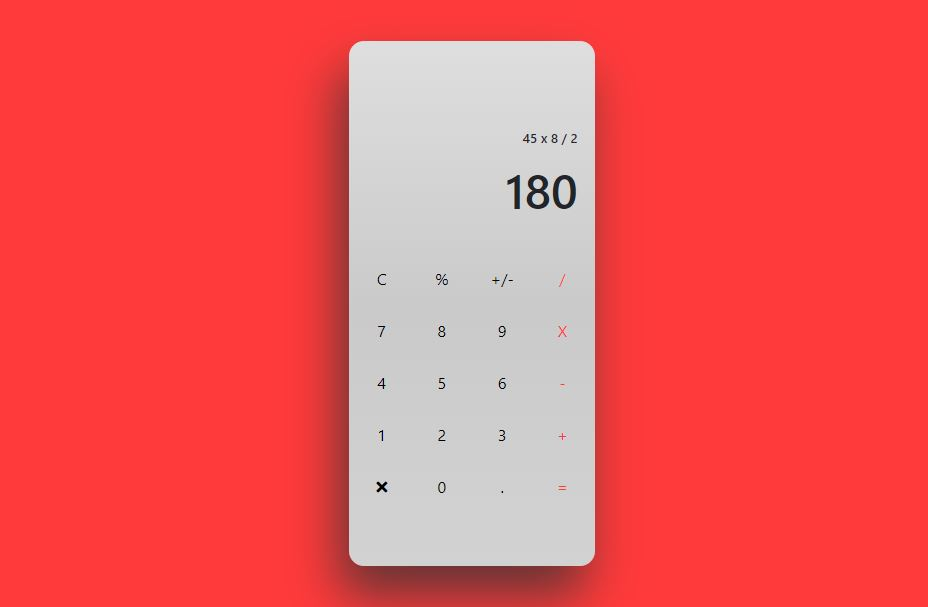
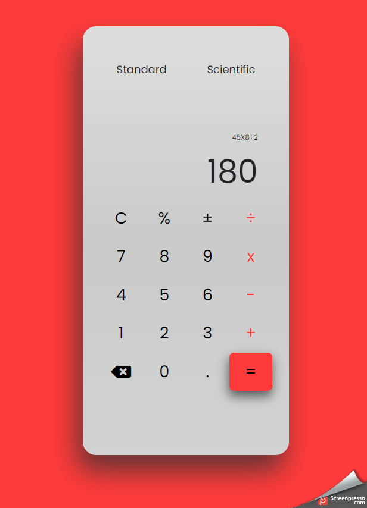

# Calculadora 

##Projeto baseado em Design UX de Ana Clara [Figma @AnaCriando](https://www.figma.com/file/I0TKs9k0MdAc80l61SjzCE/Calculator-Daily-UI-004-Community?node-id=1%3A2/). 

  
  

##Dia 1 Após 5 horas de trabalho

- Principal desafio estava sendo adequar o botão %, responsavel por converter o numero da porcentagem solicitado, dividitando o valor em 100
- Exemplo: "Quero saber quanto é 25% de 100". Executado na calculadora 100X25 e abertado o botão % Esperado é 25/100 e apresentar o valor na tela após a multiplicação.  

  

##Finalização? 

- Resultado após inclusão da funcionalidade nos botões % (divisão de numero para calculo de porcentagem) e ± (conversor de sinal da operação). 
- Inclusão dos <li> Standard e Scientific com animação de 

- Ajustada aparencia do botão = para corresponder ao template. 

  

